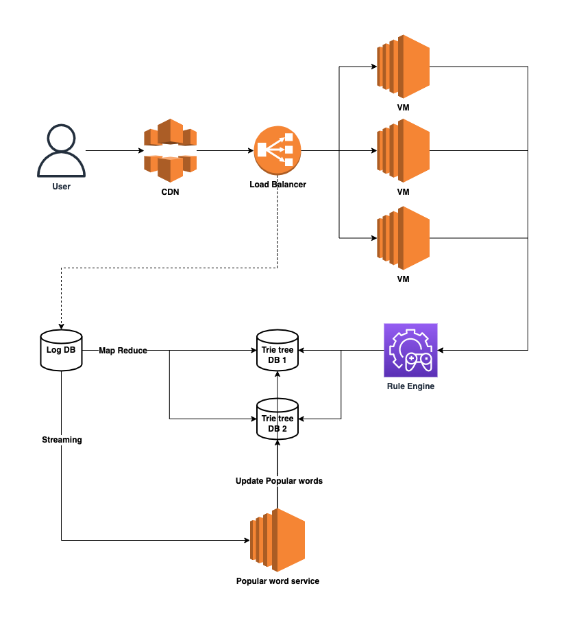

# Auto Complete Service

---

## System architecture

---

## High level design

- Log analysis
  - Offline
    - Hadoop/Spark -> Generate trie tree
  - Online
    - Streaming -> Update trie tree
- API service
  - Stateless
  - Access trie tree
  - High availability

---

## Components design

- Implementation for trie tree
  - Data structure
    - hash map (v)
    - array

  - hash table
    - sparsity
    - unicode

- Sharding
  - How to balance trie tree
  - Consistency hashing?

## Backend detail
- How long should we update the whole trie tree?
  - one week ?

- How to update trie tree
  - Online
    - local update (popular words)
  - Offline
    - Blue/Green upgrade

- How to store trie tree
  - memory 
  - disk

- Cache for popular search
  - when to expire

## Frontend detail
- Reduce QPS
  - Only request after keyup, delayed about 100 ms
  - Local cache
    - localstorage, ...

## Other questions

- Personalized recommendation
- Auto correction
- How to estimate the size of trie tree
- AP in CAP
  
---

## Reference
- https://www.youtube.com/watch?v=uIqvbYVBiCI&t=584s
- http://www.noteanddata.com/interview-problems-system-design-learning-notes-autocomplete.html
- 