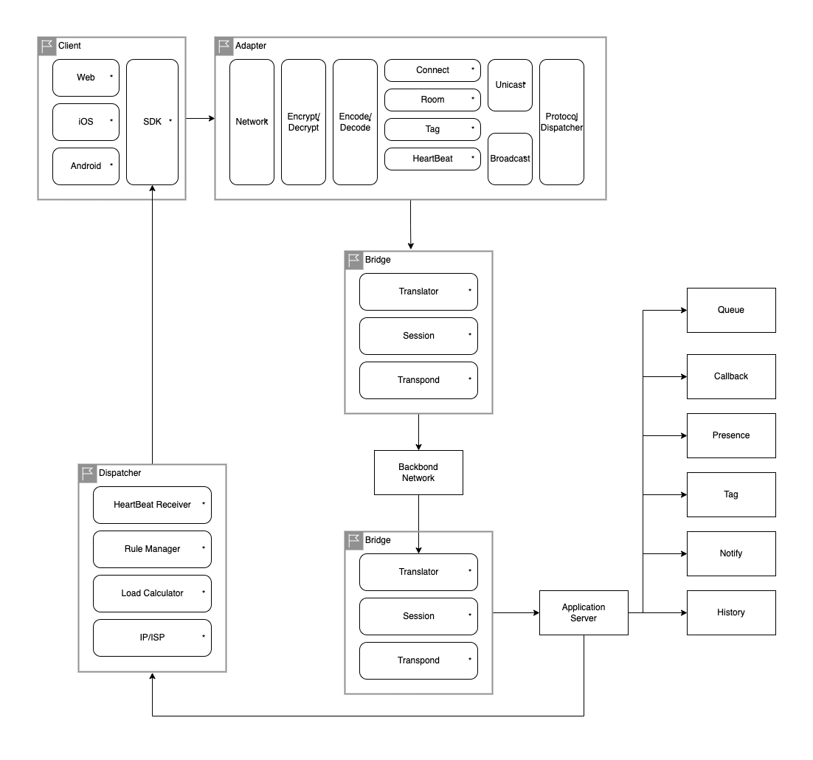

# Chat System

---

## Architecture

---

### Client
- Type
  - Web
  - iOS
  - Android
- SDK

### Adapter
- Module
  - Network
    - Edge Node
  - Encrypt/Decrypt
    - Symmetric encryption/decryption
    - Asymmetric encryption/decryption
    - Support for 0-RTT (e.g. QUIC)
      - Allows clients to send data on the first flight ("early data")
  - Encode/Decode

  - Connect
    - Websocket
    - long polling
  - Room
    - Group for connections
  - Tag
    - Label for connections
  - HeartBeat mechanism
    - Report HeartBeat messages to Dispatcher
  - Unicast
  - Broadcast
    - Flow control
  - Protocol Dispatcher
- Performance optimization
  - Reduce the frequency for encoding/decoding data
    - Serialization
    - Compression
  - Multi-Thread development
  - Merge messages
  - Reduce memory copy
  - ...
- Adaptive flow control strategy
    - Single node flow control
      - monitor local node bandwidth
    - Single connection flow control
      - monitor long connection and message deliver speed

### Bridge
- Module
  - Translator
    - Transfer protocol
  - Session Management
  - Transponder

### Dispatcher
- Module
  - HeartBeat Receiver
  - Rule Manager
  - Load Calculator
    - CPU
    - Memory
    - Network bandwidth
  - IP/ISP
    - Topology

### Application Server
- Module
  - Queue
  - Callback
  - Presence
  - Tag
  - Notify
  - History
  - ...

## Reference
- https://juejin.cn/post/6973939473272799269
- https://developer.aliyun.com/article/698301
- http://www.erlang-factory.com/upload/presentations/31/EugeneLetuchy-ErlangatFacebook.pdf
- https://segmentfault.com/a/1190000040708242
- http://www.52im.net/thread-812-1-1.html
- http://www.52im.net/thread-3393-1-1.html
- http://www.52im.net/thread-3445-1-1.html
