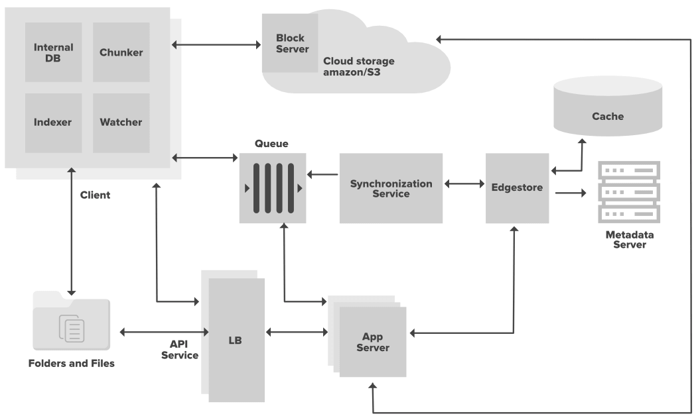
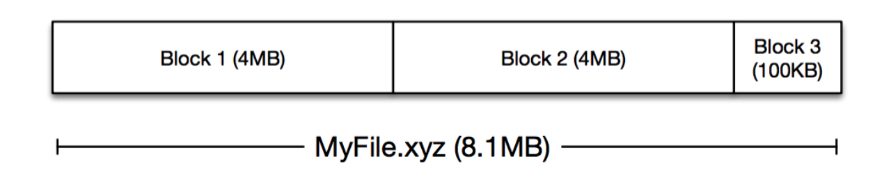
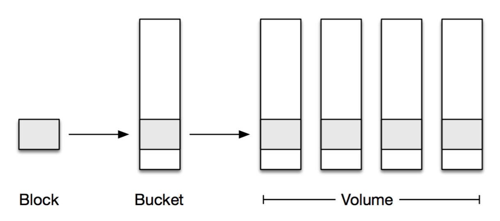
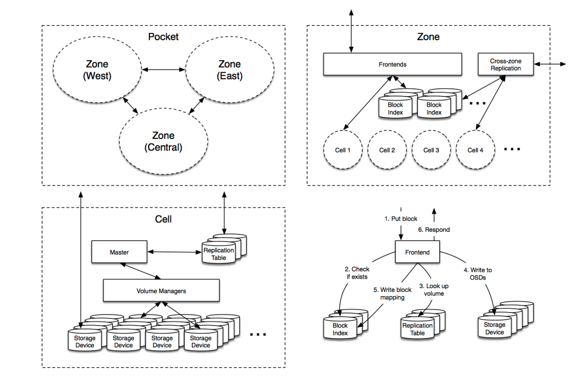

# Design Google Drive

---

## Requirement
- Add files. The easiest way to add a file is to drag and drop a file into Google drive.
- Download files.
- Sync files across multiple devices. When a file is added to one device, it is automatically synced to other devices.
- See file revisions.
- Share files with your friends, family, and coworkers
- Send a notification when a file is edited, deleted, or shared with you.
- (Option) Google doc editing and collaboration.
 
## System architecture
- 
- Client
  - Watcher 
    - monitors the sync folders and notifies the Indexer of any action performed by the user for example when user create, delete, or update files or folders.
  - Chunker 
    - splits the files into smaller pieces called chunks. To reconstruct a file, chunks will be joined back together in the correct order. A chunking algorithm can detect the parts of the files that have been modified by user and only transfer those parts to the Cloud Storage, saving on cloud storage space, bandwidth usage, and synchronization time.
  -  Indexer 
     -  processes the events received from the Watcher and updates the internal database with information about the chunks of the modified files. Once the chunks are successfully submitted to the Cloud Storage, the Indexer will communicate with the Synchronization Service using the Message Queuing Service to update the Metadata Database with the changes.
  - Internal Database 
    - keeps track of the chunks, files, their versions, and their location in the file system

- Object storage service
   - Requirements
     - Immutable block storage
       - When a user makes changes to a file on Dropbox we record all of the alterations in a separate system called FileJournal. This enables us to have the simplicity of storing immutable blocks while moving the logic that supports mutability higher up in the stack.
     - Workload
       - a high degree of temporal locality
       - cold storage system
         - low-latency reads for all blocks
      - recent uploads
       - high degree of initial replication and caching
      - other data
       - storage encoding
  
     - Durability
       - erasure-coded
       - stored across multiple geographic regions
     - Scale
       - double-digit-petabyte -> multi-exabyte
     - Simplicity
       - eschews quorum-style consensus or distributed coordination as much as possible
       - heavily leverages points of centralized coordination when performed in a fault-tolerant and scalable manner
       - Block Index
         - (O) distributed hash table or trie
         - (X) A giant sharded MySQL cluster
     - Data Model
       - 
       - 
   - Arch
     - 
   - Object Storage vs Block Storage
     - File system is one kind of block storage

## Problem
- How to delete data in Object storage if it is based on the immutable storage

- How to compute the checksum for the whole file
  - Split the file into blocks of 4 MB (4,194,304 or 4 * 1024 * 1024 bytes). The last block (if any) may be smaller than 4 MB.
  - Compute the hash of each block using SHA-256.
  - Concatenate the hash of all blocks in the binary format to form a single binary string.
  - Compute the hash of the concatenated string using SHA-256. Output the resulting hash in hexadecimal format.

- When data deduplication be used? And how?
  - Post-process deduplication
    - When: After uploading files to server
    - Pros
      - Client don't need to wait for hash computation or lookup.
    - Cons
      - store duplication data (althrough it may be deletd after a while)
      - waste the bandwidth to transfer duplication data
  - In-line deduplication

- how one client listen to other clients' file change events
  - long polling
  - websocket

- Should we keep metadata replica in the localhost
  - Yes. it can help us update without Internet and save the bandwidth to get metadata
  - Should all kinds of devices synchronize file change immediately
    - No. Mobile device should synchronize file change on demand to save bandwidth and storage size

## Reference
1. https://blog.csdn.net/qiansg123/article/details/80124278
2. https://blog.csdn.net/weixin_43946031/article/details/116081701
3. https://www.imangodoc.com/189032.html
4. https://blog.csdn.net/weixin_26705651/article/details/108497843
5. https://dotblogs.com.tw/pou/2012/05/06/71998
6. https://www.memeta.co/zh-Hant/article/1vafz_2373s.html
7. https://www.laitimes.com/article/3dhvf_3u6x6.html
8. https://dropbox.tech/infrastructure/inside-the-magic-pocket
9. https://blog.csdn.net/weixin_26705651/article/details/108497843
10. https://www.raychase.net/6345
11. https://www.dropbox.com/developers/reference/content-hash
12. https://medium.com/@thegiive/object-storage-vs-block-storage-7699e02bd2e1
13. https://zhuanlan.zhihu.com/p/95056777
14. https://dropbox.tech/infrastructure/how-we-optimized-magic-pocket-for-cold-storage
15. https://www.cs.purdue.edu/homes/csjgwang/CloudNativeDB/AzureStorageSOSP11.pdf
16. https://medium.com/@narengowda/system-design-dropbox-or-google-drive-8fd5da0ce55b