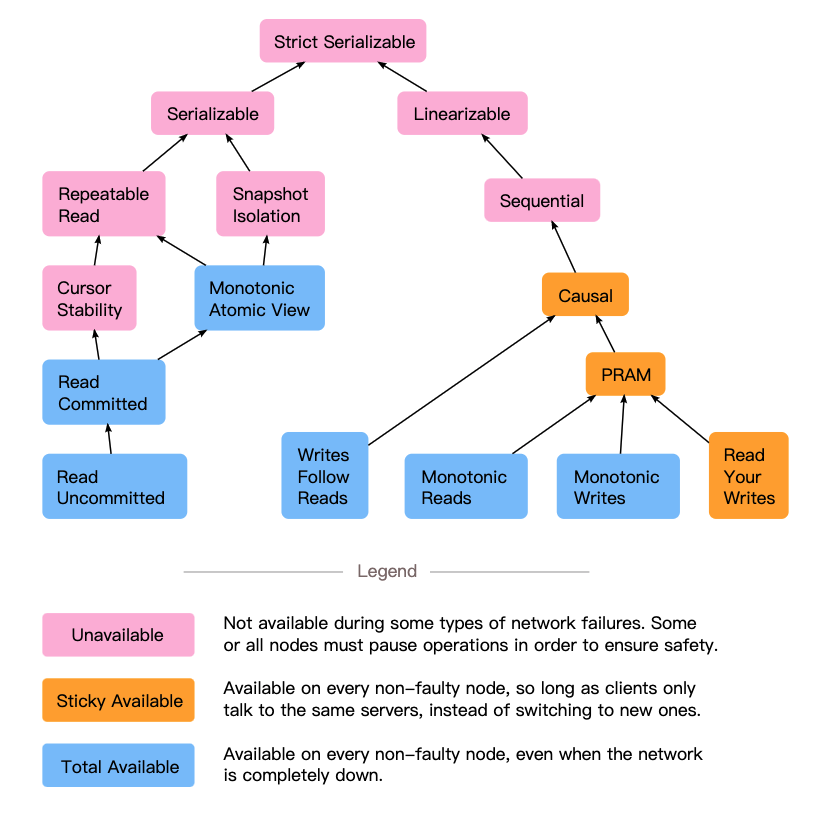

# DESIGN A KEY-VALUE STORE

---

## Requirement

- The size of a key-value pair is small: less than 10 KB.
- Ability to store big data.
- High availability: The system responds quickly, even during failures.
- High scalability: The system can be scaled to support large data set.
- Automatic scaling: The addition/deletion of servers should be automatic based on traffic. 
- Tunable consistency.
-  Low latency.

---

## CAP
- myth: we have to choose consistency or availability and it can't be changed.
    - In the different situation, we will choose various methods to design distributed system 
- CAP ignore network latency
- The difference between theory and practice is 
  - the availability (service time) we can accept (e.g. 99% vs 99.9% vs 99.99%)
  - the data consistency type we can accept
    - strong consistency
    - weak consistency
    - final consistency
- Consistence means strong consistence

---

## Consistency Models

---

## Read-Repair and Anti-Entropy

---

## Strict Quorum

- W+W > N and W+R > N
- Low availability

---

## Sloppy Quorum & Hinted Handoff

- Alaways Writable

---

## Vector clock
- Problem
  - Don't know the total node number
  - vector size

---

## Consensus Algorithm
### Consensus Algorithm Requirements
- Termination
- Validity
- Agreement

---

- System Model
  - Network Model
    - Synchronous network
    - Asynchronous network
  - Failure Model
    - Byzantine failures
    - Crash-recovery failures
    - Omission failures
    - Crash failure

---
## FLP Impossibility
No completely asynchronous consensus protocol can tolerate even a single unannounced process death. 

---

## Algorithm example
- Paxos
- Raft
- Two-Phase Commitment (2PC)
- Three-Phase Commitment (3PC)
- ...

---
## System components
- Data partition
- Data replication
- Consistency
  - W+R > N: avoid concurrent read/write
  - W+R = N: concurrent read + write -> stale reads possible
  - W+W > N: avoid concurrent write
  - W+W <= N: concurrent write -> inconsistency possible
  - R+R > N: irrelevant without writes
- Inconsistency resolution
  - who solve conflict
    - application vs database
    - 
- Handling failures

- System architecture diagram
- Write path
- Read path
- Timestamp
  - Lamport Logical Clock (Lamport timestamp)
    - MAX(local_time, remote_time) + 1
  - Causality
    - Vector Clock

---

## Reference
- https://www.infoq.cn/article/cap-twelve-years-later-how-the-rules-have-changed/
- https://zhuanlan.zhihu.com/p/41228196
- https://arthurchiao.art/blog/amazon-dynamo-zh/
- https://static.googleusercontent.com/media/research.google.com/en//archive/bigtable-osdi06.pdf
- https://snaildove.github.io/2019/12/31/Paper-Google-Bigtable_translation-and-summary_online/
- https://ithelp.ithome.com.tw/articles/10218827
- https://jepsen.io/consistency
- https://moz.com/blog/knowing-black-hat-seo