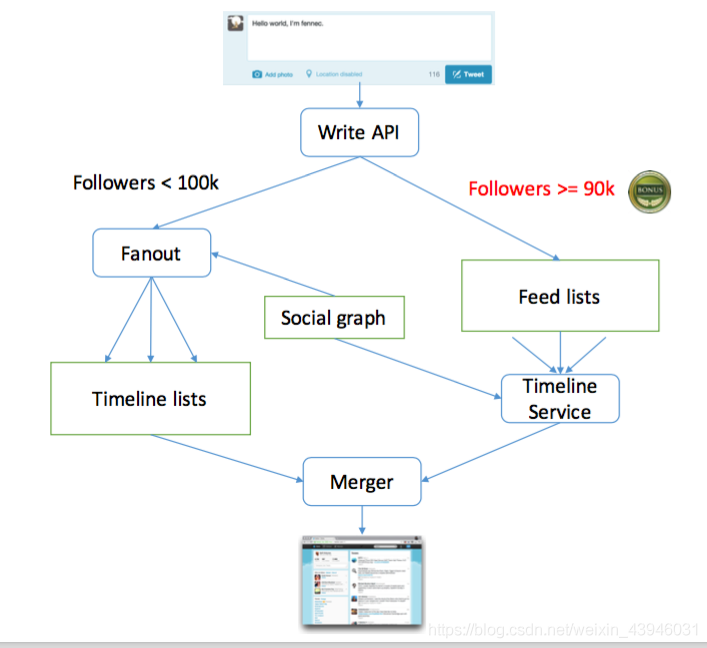

# News Feed System

---

## 4S Method
- Scenario
  - Features / QPS / DAU / Interfaces
- Service
  - Split services / Modularization
- Storage
  - Schema / Data / SQL / NoSQL /File System
- Scale
  - Sharding / Optimize / Special Case


---

## Analysis
- Scenario
  - Features
    - mobile & web app
    - publish / receive posts
    - sorted by reverse chronological order
    - At most 5000 friends
    - 10 million DAU (Daily Activated Users)
    - contain text and media files, including both images and videos
- Service
  - Split services / Modularization
  - News Feed System
    - user service
    - tweet service
    - media service
    - friendship service
- Storage
  - Schema / Data / SQL / NoSQL / File System
  - Data how to be accessed and visited
    - Select
      - Choose the appropriate data structure for each application and service
    - Schema
      - Detail the data table structure
  - Choice
    - Relation Database
      - User table
    - NoSQL Database
      - Document Database
        - User Post
      - Graph Database
        - Social Graph (for followers)
      - File System
        - image
        - video
        - audio
        - ...
      - Cache
        - along with relation database
        - hot data

- Scale
  - Robust / Maintenance / Scalability / Optimize / Sharding


---

## Fan Out


Problem:
- Should we need "Fan in read" or Hybrid mode when at most 5000 friends
  - Only "Fan in write" is OK

---

## Data sharding
- Sharding feed
  - ```Map<
        UserId,
        Struct {
                LinkedHashMap<FeedId, Feed> feeds,
                DateTime lastGeneratedTime
        }
    ```
  - Shard by UserId 
- Sharding post and metadata
  - Shard by UserID
    - Hot Spot
  - Shard by PostId
    - High DB latency
  - Shard by creation time
    - Unbalanced traffic
  - Hybrid: Shard = PostId + Creation time
    - Medium latency

---

## Extension
- [Activity Stream](https://en.wikipedia.org/wiki/Activity_stream)
  - User
  - Activity
    - Atom
      - Time
      - Actor
      - Verb
      - Object
      - Target
      - Title
      - Summary
  - Connection
    - from
    - to
    - type/name
    - affinity

- Topic scores
  - EdgeRank
    - Affinity Score
    - Edge Weight
    - Time Decay
- Machine Learning

---

## Reference
- https://www.jyt0532.com/2020/02/11/design-instagram/
- https://blog.csdn.net/weixin_43946031/article/details/117581928
- https://kknews.cc/zh-tw/tech/xzq9yz8.html
- https://massivetechinterview.blogspot.com/2015/08/feedstimeline.html
- https://zhuanlan.zhihu.com/p/103484396
- https://xunrongl.gitbooks.io/system-design/content/news-feed-system.html
- 
