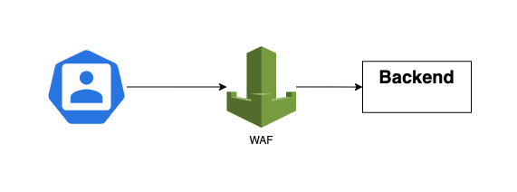
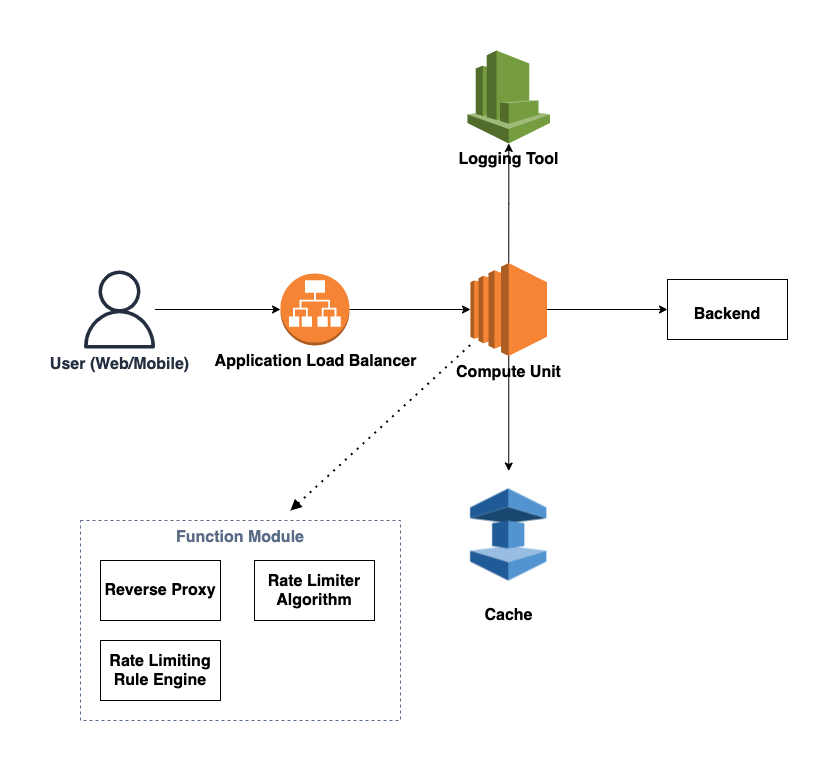
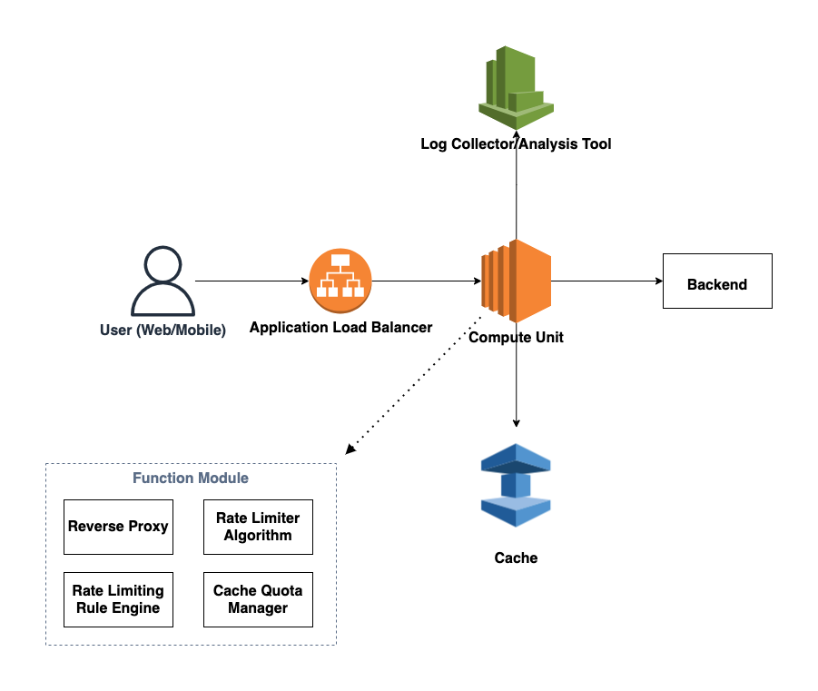

# Rate Limit

---

## Why we need rate limiter?

* Prevent resource starvation caused by Denial of Service (DoS) attack
* Limiting excess requests means fewer servers and allocating more resources to high priority APIs
* To reduce server load, a rate limiter is used to filter out excess requests caused by bots or users’ misbehavior.

---

## Requirements

* Accurately limit excessive requests.
* Low latency. The rate limiter should not slow down HTTP response time.
* Use as little memory as possible.
* Distributed rate limiting. The rate limiter can be shared across multiple servers or processes.
* Exception handling. Show clear exceptions to users when their requests are throttled.
* High fault tolerance. If there are any problems with the rate limiter (for example, a cache server goes offline), it does not affect the entire system.

---

## Solution

I will provide several solutions for the rate limiter feature

---

* 

  + Description
    - We can subscribe/purchase WAF (web application firewall) as our rate limiter
    - If we have no time but have money to purchase SaaS, Cloud Service or other products, it is a good choice
    - Now WAF in every cloud platform has basic rate limiting feature
      - e.g. [AWS WAF](https://aws.amazon.com/tw/blogs/security/three-most-important-aws-waf-rate-based-rules/) 
        - Blanket rate-based rule
        - URI-specific rate-based rule
        - IP reputation rate-based rule
  + Pros
    - Fast and easy to use
    - Service level guarantee or agreement (SLA)
    - Low develop time and maintenance cost
  + Cons
    - Expensive
    - Low flexibility

---

* 

   - Assumption
     - Clients include Web client and mobile devices
     - At least 10000 concurrent request per second
   - Description 
     - Infrastructure layer
       - Application Load Balancer
       - Compute Unit
         - Can be VM, Container, Serverless services
         - Need to implement auto scaling feature
         - Module
           - Reverse Proxy
           - Rate Limiter Algorithm
           - Rate Limiting Rule Engine
       - Cache
         - Redis
           - About command property
             - Redis command is atomic
             - MULTI command can pack multi redis command act as a transaction
           - About cluster
             - Don't use Redis Sentinel
             - Use [Redis Cluster](https://redis.io/topics/cluster-spec) (Feature from Redis 3.0)
               -  Linear scalability up to 1000 nodes
             - Consider to use Redis 6.0 because of multi-thread
             - Even we use multi-thread Redis, it will guarantee command is atomic
       - Logging Tool
         - collect log for advance analysis
         - Can use TCP/UDP to collect log
       - Backend Service

     - Application layer
       - Use JWT as access token and refresh token
       - Compute Module
           - Reverse Proxy
           - Rate Limiter Algorithm
              - Token bucket
              - Leaking bucket
              - Fixed window counter
              - Sliding window log
              - Sliding window counter
           - Rate Limiting Rule Engine
             - Can use YAML as template system
             - Can have multiple rate limiting rule. Every request need to pass all rules.
             - Need to define property
               - Which algorithm we will use
               - The environment variable for the algorithm
               - The condition we will limit
                 - URL (All or specific URL)
                 - Header
                   - JWT token
                   - referer
                   - Real IP in HTTP header
                     - HTTP_CLIENT_IP
                       - HTTP_X_FORWARDED_FOR
                       - HTTP_X_FORWARDED
                       - HTTP_X_CLUSTER_CLIENT_IP
                       - HTTP_FORWARDED_FOR
                       - HTTP_FORWARDED
                       - REMOTE_ADDR
                       - HTTP_VIA
                   - ...
                 - Time unit
                 - Request per time unit
   - Pros

   - Cons
   - Problems

---

* 

   - Assumption
     - Clients include Web client and mobile devices
     - At least 10000 concurrent request per second
   - Description
     - Infrastructure layer
       - Application Load Balancer
       - Compute Unit
         - Module
           - Reverse Proxy
           - Rate Limiter Algorithm
           - Rate Limiting Rule Engine
           - Cache Quota Manager
       - Cache
         - Redis cluster
       - Logging Tool
       - Backend Service
     - Application layer
       - Use JWT as access token and refresh token
       - Compute Module
           - Reverse Proxy
           - Rate Limiter Algorithm
           - Rate Limiting Rule Engine
           - Cache Quota Manager
             - Each compute unit(e.g. VM) can get a few quota from redis
             - When receive requests, it will deal with the requests if remaining quota is not empty
             - Developers need to deal with some situations
               - Compute unit may fail
               - Expiration and update of the quota (quota need to be released periodically)
                 - can use Redis 6 feature: RESP3
   - Pros

   - Cons
