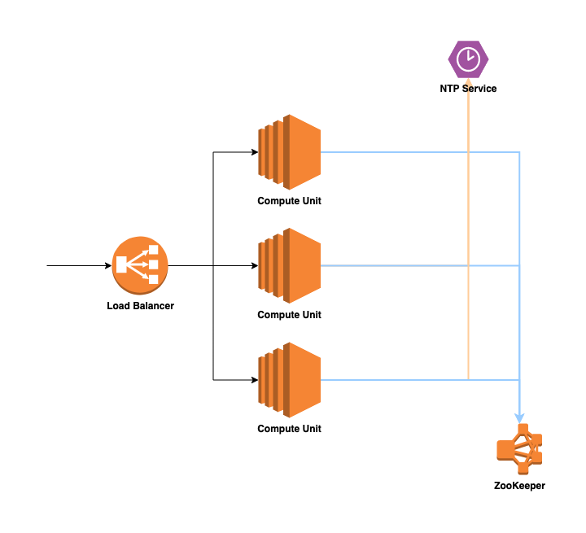

# Distributed Unique ID Generator

---

## Requirement
- IDs must be unique.
- IDs are numerical values only.
- IDs fit into 64-bit.
- IDs are ordered by date.
- Ability to generate over 10,000 unique IDs per second.

---

## Method
1. UUID
   -  content
      - The form is 8-4-4-4-12
      - A total of 36 characters.
      - Sample Code
        ```java
        import java.util.UUID;
        public static void main(String[] args) {
            String uuid = UUID.randomUUID().toString().replaceAll("-","");
            System.out.println(uuid);
        }
        ```
   - pros
      - simple
      - the local generation has no network consumption
   - cons
      - do not have the trend auto increasing feature
      - have no specific business meaning
      - no order
      - too long
      - not number type but string type
      - poor storage performance
      - time-consuming query
  
2. Self increment ID based on Database
   -  content
      -  Single MySQL server
      - When we need an ID, insert a record into the table and return the primary key ID
      - Sample Code
        ```sql
        CREATE DATABASE `SoWhat_ID`;
        CREATE TABLE SoWhat_ID.SEQUENCE_ID (
            `id` bigint(20) unsigned NOT NULL auto_increment, 
            `value` char(10) NOT NULL default '',
            `update_time` timestamp NOT NULL DEFAULT CURRENT_TIMESTAMP ON UPDATE CURRENT_TIMESTAMP,
            PRIMARY KEY (id),
        ) ENGINE=MyISAM;
        insert into SEQUENCE_ID(value) VALUES ('values');
        ```
   - pros
      - simple implementation
      - ID monotone self increment
      - fast query speed of numerical type
   - cons
      - single point of failure
      - MySQL is the bottleneck of the system


3. Based on database cluster mode
    - content
      - Multi-master mode
      - Two MySQL instances can independently produce auto increment IDs
      - Sample code
        ```sql
        -- MySQL 1 Configuration
        set @@auto_increment_offset = 1;     -- Starting value
        set @@auto_increment_increment = 2;  -- step
        
        -- MySQL 2 Configuration
        set @@auto_increment_offset = 2;     -- Starting value
        set @@auto_increment_increment = 2;  -- step

        -- In this way, the self increment ID of two MySQL instances are:
        -- MySQL 1 Server: 1,3,5,7,9 
        -- MySQL 2 Server: 2,4,6,8,10
        ```
    - pros
      - High availability than Single MySQL
    - cons
      - Hard to add new MySQL Node
        - To add a new MySQL instance, we need to manually modify the start value and step size of several MySQL instances
        - The auto increment ID will be repeated and may be returned if necessary It needs to be stopped for modification.

4. Segment pattern based on database
   - content
     - batch auto increment ID from database
     - one segment range is taken from database each time
     - Sample code
    ```sql
    CREATE TABLE id_generator (
        `id` int(10) NOT NULL,
        `max_id` bigint(20) NOT NULL COMMENT 'Current maximum id',
        `step` int(20) NOT NULL COMMENT 'Step size of segment',
        `biz_type`    int(20) NOT NULL COMMENT 'Business type',
        `version` int(20) NOT NULL COMMENT 'Version number',
        PRIMARY KEY (`id`)
    )
    -- max_id: the current maximum available id
    -- step: represents the length of the segment
    -- biz_type: represents different business types
    -- Version: it is an optimistic lock, which updates version every time to ensure the correctness of data during concurrency


    -- Update segment
    update id_generator set max_id = {max_id+step}, version = version + 1 where version =  {version} and biz_type = XX
    ```
    | id | biz_type | max_id | step | version |
    |:--:|:--------:|:------:|:----:|:-------:|
    | 1  | 101      | 1000   | 2000 | 0       |


   - pros
     - do not rely on the database strongly and
     - do not visit the database frequently
   - cons
     - if you encounter double 11 or black Friday, similar activities will still have relatively high access to the database.
  
5. Based on Redis mode
    - content
      -  The principle is that redis is single threaded, so we can use the incr command of redis to realize the atomic auto increment of ID.
      - Sample code
    ```shell
    127.0.0.1:6379> set seq_id 1     // Initialize auto increment ID to 1
    OK
    127.0.0.1:6379> incr seq_id      // Increases by 1 and returns the incremented value
    (integer) 2
    ```
    - pros
      - Single thread before Redis 6.0
    - cons
      - persistence
6. Based on Snowflake model
    - content
    - pros
    - cons
7. Baidu uid generator
    - content
      - SnowFlake
    - pros
    - cons
8. Leaf
    - content
      - Segment pattern + SnowFlake
    - pros
    - cons
9. Tinyid
    - content
      - Segment pattern
    - pros
    - cons

---

## Snowflake

- 

- Consider Consistency
  - Strong consistency: ZooKeeper (Paxos Protocol)
  - Eventually consistency: Consul (Gossip Protocol)

- Consider durability
  - Should we store the ID with the target into the disk/memory
  - Could we just assign number plates without durability
- Consider Speed
  - for each VM, each can handle (65535 - 1024) number
    - (65535 - 1024) port for each VM
- Consider the target
  - frontent vs backend
  - The JavaScript Number type is a double-precision 64-bit binary format IEEE 754 value
    - Number.MAX_SAFE_INTEGER = 2^53 - 1 
    - Replace number type with string type

- How to get workerID?
  - Through ZooKeeper

- Should we use mutli-thread in one VM?
  - If yes, we have to avoid race condition
    - In Java/Scala: synchronized
- What if one VM assign over 4096 number plates in one millisecond
  - While loop to next millisecond

- What if current timestamp <  last timestamp?
  - Rejecting requests until last timestamp

- bitwise operation for speed up


---

## Reference
- https://www.fatalerrors.org/a/9-kinds-of-distributed-id-generation-methods-there-is-always-one-for-you.html
- https://zhuanlan.zhihu.com/p/107939861
- https://curator.apache.org/curator-recipes/distributed-atomic-long.html
- https://blog.51cto.com/u_12633149/3699877
- https://github.com/twitter-archive/snowflake/tree/snowflake-2010
- https://segmentfault.com/a/1190000011282426?utm_source=sf-similar-article
- https://instagram-engineering.com/sharding-ids-at-instagram-1cf5a71e5a5c#.nk5946458
- https://github.com/baidu/uid-generator
- https://github.com/beyondfengyu/SnowFlake/blob/master/SnowFlake.java
