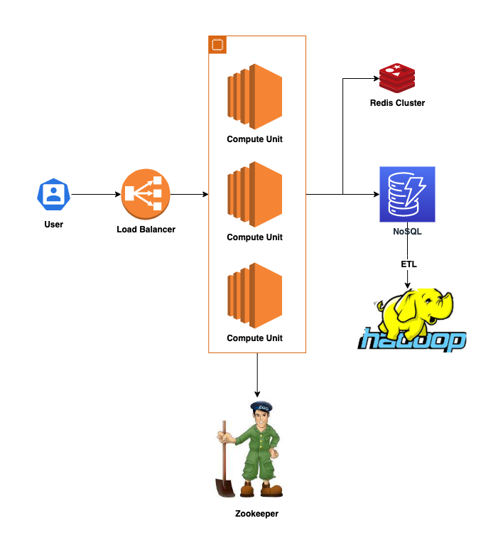
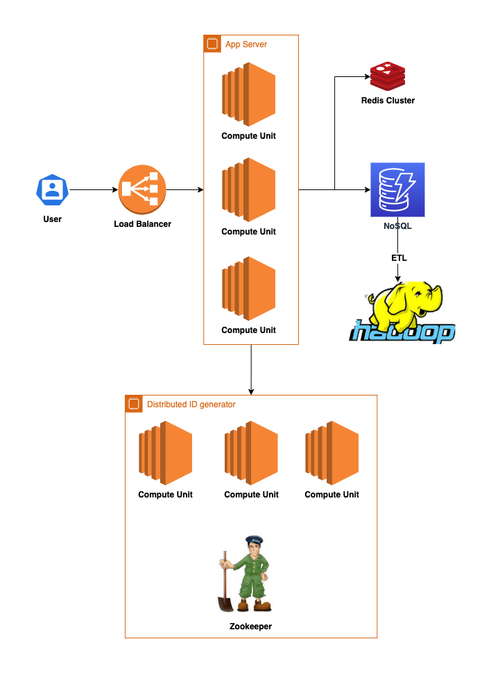

# URL SHORTENER

---

## Requirements

- Write operation: 100 million URLs are generated per day.
- Write operation per second: 100 million / 24 /3600 = 1160
- Read operation: Assuming ratio of read operation to write operation is 10:1, read operation per second: 1160 * 10 = 11,600
- Assuming the URL shortener service will run for 10 years, this means we must support 100 million * 365 * 10 = 365 billion records.
- Assume average URL length is 100.
- Storage requirement over 10 years: 0.1 billion * 100 bytes * 3650 days = 36.5 TB (NOT 365 TB)

---

## Architecture

- 
  - App Server
    - API for creating/getting short URL
    - API for moving expired URL from NoSQL to other storage
    - Distributed ID generator
  - NoSQL
    - Store ID and origin URL
  - Hadoop
    - Analyze who click which URL at what time
  - Zookeeper
    - Manage nodes
    - Manage sequence range

- 
  - App Server
    - API for creating/getting short URL
    - API for moving expired URL from NoSQL to other storage
  - Distributed ID generator

---

## Tradeoff
1. Should we regard origin URL and encoded URL as the same URL
2. Should we use http code 301 vs 302?
   1. 301: reduce the server overhead but can't analyze users' behavior
   2. 302: increase the server overhead but easily to collect data
3. Should we build a cluster as a distributed ID generator or just use zookeeper
4. Should we use cache
   1.  Pareto principle (80/20 rule)
5. Should we use hash function to convert long URL
   1. Problem 1: Hash collision
   2. Problem 2: Does two short URL be generated by two different users are the same?
6. How could we deal with the expired data
   1. where will we store these data? blob storage? tape?
   2. when will we expire these data
      1. schedule job? What if it makes high overhead?
         1. build an offline process. execute it only if the overhead is low
7. Data analysis
   1. how should we build a ETL pipeline
      1. scheduler + batch job
      2. streaming + message queue

## Reference
1. https://www.jyt0532.com/2019/12/05/design-tiny-url/
2. https://codemonkey.coderbridge.io/2021/07/11/web-structure-design
3. https://soulmachine.gitbooks.io/system-design/content/cn/tinyurl.html
4. https://www.twblogs.net/a/5db35e84bd9eee310ee68793
5. https://kknews.cc/zh-tw/code/n25gkb2.html
6. https://iter01.com/525762.html
7. https://hackmd.io/@keronscribe/H1_UkDtEH
