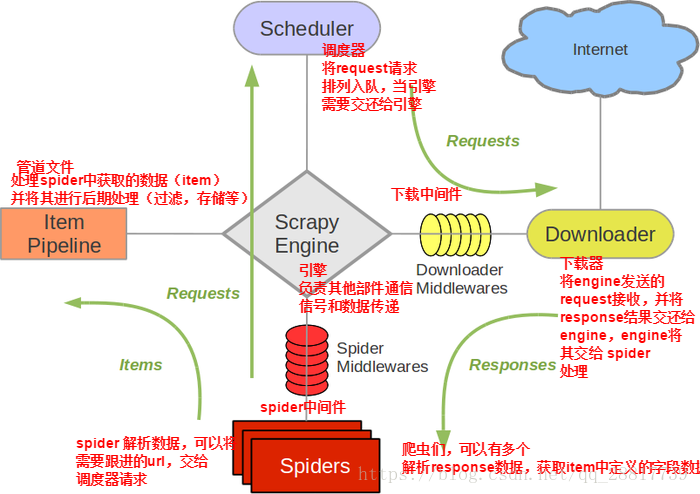

# WEB CRAWLER

---

## Property
- Distributed computing
- Module augmentability
- Feature modularize
- Can be monitored
- High performance
- De-duplication collection

---

## Requirement

---

## URL frontier
- Politeness
  - Robots exclusion protocol
    - Crawl-delay
  - Need to trade-off coverage, freshness, and bias
    - toward "important" pages
- Priority
  - Spam page
  - Politeness

---

- HTML downloader
  - User agent pool/user agent faker
  - Cookie pool
  - Proxy IP pool
  - Tor (Maybe not a good idea)

---

## Auto scaling
- Balance between Producer(Queue size) and Consumer(Downloader)

---

## Summary

---

## Reference
- https://iter01.com/338.html
- https://www.itread01.com/content/1542831726.html
- https://cloud.tencent.com/developer/article/1580789
- https://carl.cs.indiana.edu/fil/Papers/crawling.pdf
- https://www.cis.uni-muenchen.de/~yeong/Kurse/ss09/WebDataMining/kap8_rev.pdf
- https://nlp.stanford.edu/IR-book/html/htmledition/the-url-frontier-1.html