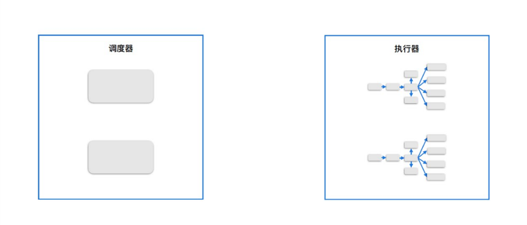
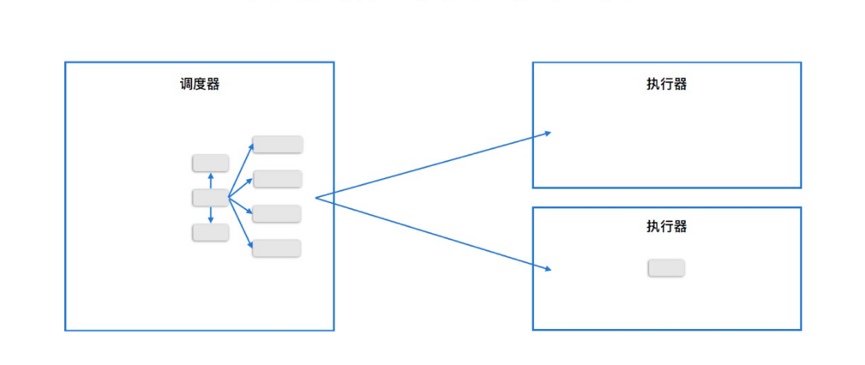
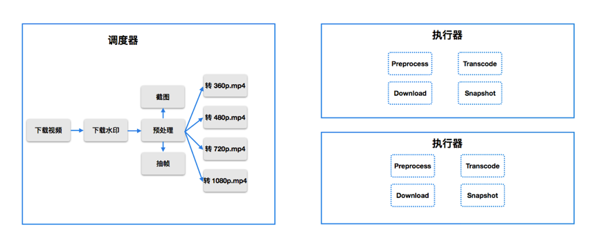
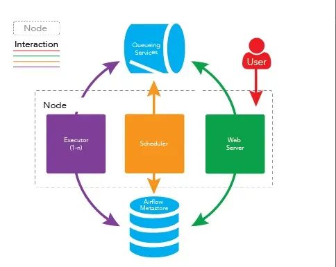
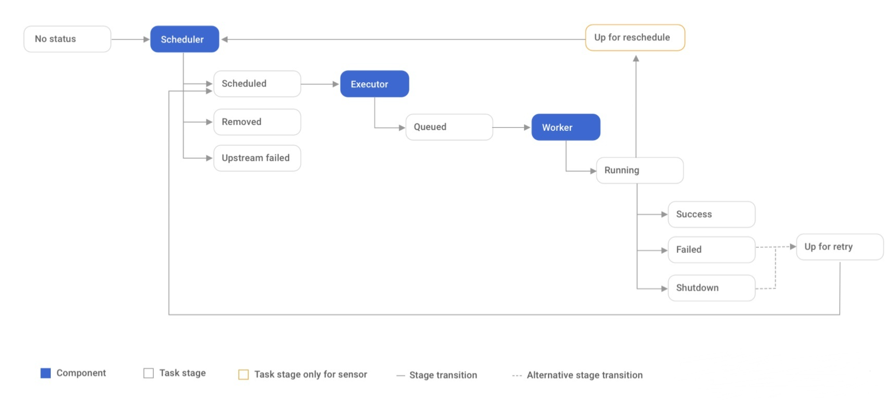
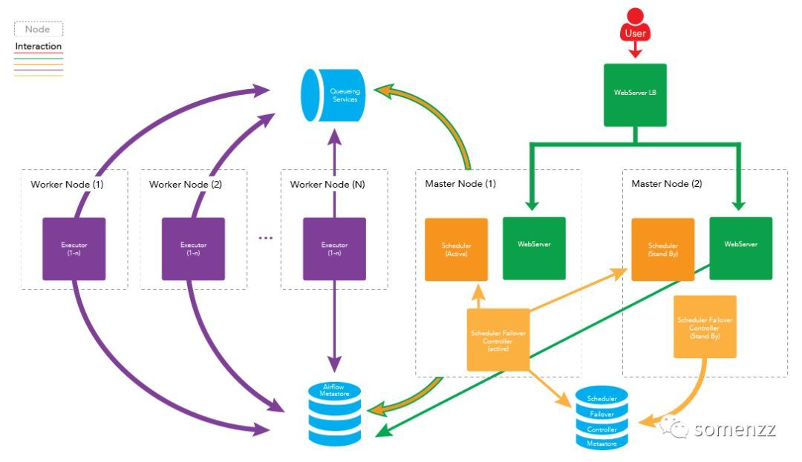
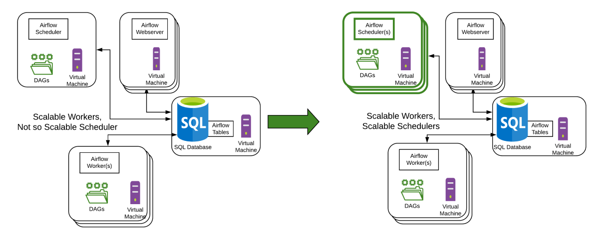

# Design Youtube

## Requirement
- Ability to upload videos fast
- Smooth video streaming
- Ability to change video quality
- Low infrastructure cost
- High availability, scalability, and reliability requirements
- Clients supported: mobile apps, web browser, and smart TV

## Problem
- Storage
- CDN
  - Route
  - Cost
  - Capacity
  - Caching efficiency
- Scheduler
  - DAG
- Encoder/Decoder
  
## DAG
- Requirement
  - flexibility
  - Speed
  - Stability

- Architecture
  - Old architecture
    - 
  - New architecture
    - 
    - 
  - Apache Airflow
    - Basic architecture
      - 
      - 
    - v1
      - One scheduler per time period
      - 
    - v2
      - 
      - Database Requirements
        - PostgreSQL 9.6+ or MySQL 8+
        - Ensure that only a single scheduler is in this critical section at once
        - use database row-level locks (using SELECT ... FOR UPDATE)
        - The critical section is obtained by asking for a row-level write lock on every row of the Pool table
        - roughly equivalent to SELECT * FROM slot_pool FOR UPDATE NOWAIT

## Reference
1. https://wizardforcel.gitbooks.io/gainlo-interview-guide/content/sd22.html
2. https://wizardforcel.gitbooks.io/gainlo-interview-guide/content/sd23.html
3. https://www.upyun.com/opentalk/399.html
4. https://netflixtechblog.com/content-popularity-for-open-connect-b86d56f613b
5. https://www.cnblogs.com/jhno1/p/14943297.html
6. https://blog.csdn.net/u013289115/article/details/120247551
7. https://www.xuehua.tw/a/5ec842ee36d9fda489a63ff7
8. https://cloud.tencent.com/developer/article/1758822
9. https://cloud.tencent.com/developer/article/1860603
10. https://developers.weixin.qq.com/community/develop/article/doc/000646675342a06ac83d17fbd51013
11. https://segmentfault.com/a/1190000041323240
12. https://www.astronomer.io/blog/airflow-2-scheduler/